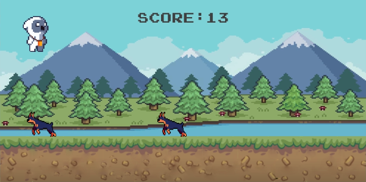

# Runner

Runner is a simple game created using the Pygame library. The objective is to control a character and avoid colliding with incoming enemies. The longer you survive, the higher your score.

## Table of Contents

- [Installation](#installation)
- [Game Controls](#game-controls)
- [How to Play](#how-to-play)

## Installation

To run the game locally, follow these steps:

1. Make sure you have Python 3.x installed on your machine.
2. Clone this repository to your local machine or download the ZIP file and extract it.
3. Open a terminal or command prompt and navigate to the project's directory.
4. Install the required dependencies by running the following command: `pip install pygame`
5. Run the game by executing the following command: `python main.py`

## Game Controls

- Mouse Click: Jump
- Spacebar: Jump

## How to Play

- The game starts with the character positioned on the ground.
- Use the mouse click or spacebar to make the character jump and avoid the incoming enemies.
- The character can only jump when it's on the ground.
- As time progresses, the game will spawn different types of enemies (dogs, birds, and hounds) at random intervals.
- If the character collides with any enemy, the game ends.
- Try to survive as long as possible and achieve the highest score!

